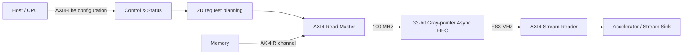

# AXI4 Read DMA with Clock-Domain Crossing

서로 다른 클록으로 동작하는 메모리 영역과 가속기 영역 사이에서 데이터를 안전하게 전달하는 AXI4 Read DMA 설계·검증 프로젝트입니다.

## Key Results

| 항목 | 결과 |
|---|---:|
| 데이터 경로 | AXI4 Read → Async FIFO → AXI4-Stream |
| 제어 경로 | AXI4-Lite CSR |
| Clock domains | 100 MHz / 약 83 MHz, asynchronous |
| Random regression | 120/120 PASS (100/83·100/33 MHz × FIFO16/32 × 30 seeds) |
| SVA fault injection | 5/5 detected |
| Long back-pressure | 500 cycles PASS |
| FIFO/Burst A/B matrix | 24/24 PASS |
| Initial post-route WNS | -2.847 ns |
| Final post-route WNS | +0.113 ns |
| Final selection | FIFO16 / MAX_BURST16 |

## Architecture



### Interface and CDC policy

| 전달 대상 | 적용 방식 | 설계 이유 |
|---|---|---|
| Reset | Async assert / synchronous release | 각 clock domain에서 reset 해제를 동기화 |
| START event | Toggle pulse synchronizer | 짧은 pulse 유실 방지 |
| Error level | 2FF level synchronizer | 안정적인 single-bit 상태 전달 |
| Data + final metadata | Gray-pointer async FIFO | multi-bit 데이터 순서와 무결성 보장 |
| Configuration | Stable snapshot protocol | 전송 중 설정값 변경 차단 |

## Engineering Decisions

### 1. AXI burst admission

발행할 burst는 행의 남은 길이, 4 KB boundary, 설정된 최대 burst, FIFO 수용 가능 공간을 함께 고려했습니다. 이미 발행한 burst를 안전하게 수용할 수 없으면 새 요청을 축소하거나 대기합니다.

주소·burst planning RTL은 포함하지 않았으며, `axi_read_master.sv`에서 요청 수락, AXI AR/R handshake, `RRESP`/`RLAST` 검사와 FIFO write 경로를 확인할 수 있습니다.

### 2. CDC structure by signal type

모든 신호에 같은 CDC 회로를 적용하지 않았습니다. Event, level, reset, multi-bit data의 특성에 맞춰 각각 Toggle, 2FF, reset synchronizer, asynchronous FIFO를 선택했습니다.

### 3. Timing closure over simulation-only performance

FIFO32는 일부 balanced-clock 조건에서 FIFO16보다 최대 18.90% 높은 throughput을 보였지만, 100 MHz post-route timing을 만족하지 못했습니다. FIFO16은 WNS +0.113 ns로 목표를 만족했으므로 최종안으로 선정했습니다.

자세한 판단 근거는 [Timing and Trade-offs](docs/TIMING_AND_TRADEOFFS.md)에 정리했습니다.

## Verification

검증은 다음 계층으로 나누어 수행했습니다.

- Directed tests: CSR, row tail, 4 KB boundary, protocol error
- Cocotb scoreboard: end-to-end data order and completeness
- SVA: AXI/AXIS stall stability, FIFO safety, DONE ordering
- Fault injection: 각 assertion이 의도한 위반을 실제 검출하는지 확인
- Random regression: clock ratio, FIFO depth, stalls, configuration 조합
- Stress: mid-transfer reset, restart, runtime error CDC, 500-cycle back-pressure

자세한 검증 항목은 [Verification Results](docs/VERIFICATION_RESULTS.md), A/B 원자료는 [FIFO/Burst metrics](results/fifo_burst_ab_metrics.csv)에서 확인할 수 있습니다.

## Published RTL

| 파일 | 공개 목적 |
|---|---|
| `rtl/axi_read_master.sv` | AXI4 AR/R handshake, response 및 RLAST 검사 |
| `rtl/async_fifo_gray.sv` | Gray pointer 기반 multi-bit CDC와 RAM inference 구조 |
| `rtl/axis_fifo_reader.sv` | AXI4-Stream back-pressure 처리 |
| `rtl/toggle_pulse_cdc.sv` | Event CDC 구현 |
| `rtl/level_sync_2ff.sv` | Single-bit level CDC 구현 |
| `rtl/reset_sync.sv` | Reset domain 처리 |
| `rtl/dma_sva.sv` | 대표 protocol/safety assertions |

전체 Top, AXI4-Lite CSR, 2D address/burst planner RTL은 공개하지 않습니다. 자세한 내용은 [Repository Contents](PUBLIC_RELEASE_SCOPE.md)를 참고해 주세요.

## Published Verification Code

| 파일 | 내용 |
|---|---|
| `model/reference_model.py` | RTL과 독립적으로 작성한 레퍼런스 모델: 설정 검증, 4 KB 경계 계산, burst 계획, FIFO 제한 수락, 기대 주소·데이터 생성 |
| `model/test_reference_model.py` | 레퍼런스 모델 단위 테스트 (11/11 PASS) |
| `tb/test_s6_random.py` | 랜덤 회귀: 주소·행 길이·stride·tile 높이·MAX_BURST, ARREADY stall, RVALID gap, TREADY back-pressure를 seed로 생성하고 레퍼런스 기대값과 대조 |
| `tb/Makefile.s6_random`, `scripts/run_s6_random_regression.sh` | 클럭 조합 × FIFO 깊이 × seed 회귀 실행 |

랜덤 회귀는 이 저장소에 없는 RTL(top, CSR, planner)이 있어야 실행됩니다. 무엇을 어떤 기준으로 검사했는지 코드로 확인하는 용도입니다.

## Representative Tests

공개된 테스트는 전체 회귀 환경이 아니라 대표 모듈과 assertion 검출 동작을 검토하기 위한 subset입니다.

필요 도구:

- Python 3
- cocotb 2.0.1
- Verilator
- GNU Make

```bash
python -m pip install -r requirements-dev.txt

make -f tb/Makefile.fifo FIFO_DEPTH=16
make -f tb/Makefile.fifo FIFO_DEPTH=32
make -f tb/Makefile.axis
make -f tb/Makefile.sva_fault FAULT_ID=A1
```

## Constraints

`constraints/axi_dma_cdc.xdc`에는 100 MHz와 약 83 MHz clock 정의 및 두 domain의 asynchronous 관계만 포함합니다. Board pin assignment는 이 IP의 out-of-context 평가 범위에 포함하지 않았습니다.

## Limitations

- AXI Read only
- Single outstanding transaction
- 4-byte aligned transfers only
- Maximum configured burst: 16 beats
- Out-of-context implementation
- No physical board or DDR traffic test
- No formal proof
- CDC 제약: XDC는 두 clock의 비동기 관계만 선언합니다. Gray pointer 버스의 bit 간 skew를 제한하는 `set_max_delay -datapath_only` 제약과 정적 CDC 검사는 아직 적용하지 않았습니다(보완 예정).
- Power values are vectorless estimates, not board measurements
- FIFO16의 양의 timing margin은 100 MHz 목표 통과를 의미하며 더 높은 Fmax를 주장하지 않음

No license is granted. All rights reserved.
