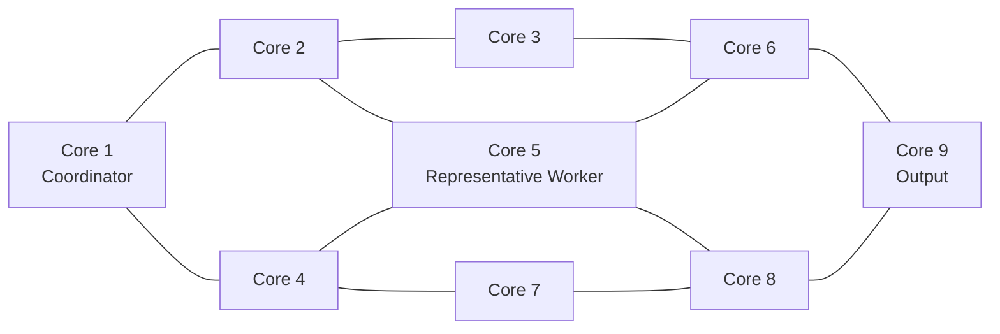

# 3×3 Distributed Multicore Image Filter — RTL Verification

9개의 8-bit CPU가 인접 코어와 픽셀을 교환해 median filtering을 수행하고, 서로 다른 완료 시점을 barrier로 동기화하는 RTL입니다.
## Architecture

- 코어 위치에 따라 참조 픽셀 수가 다름: corner 3개, edge 4개, center 5개
- 출력: `(원 픽셀 + 지역 median) / 2`
- 정렬이 compare·branch·swap 기반이라 입력 순서에 따라 실행 cycle이 달라짐 (data-dependent latency)
- Core 1이 모든 코어의 완료 신호를 모아 `end_signal_total`(barrier)을 생성

## Verification

| 확인 대상 | 방법 | 결과 |
|---|---|---|
| 출력 값 | C++ driver · monitor · 9-output scoreboard, 소프트웨어 레퍼런스와 자동 대조 | 30 vectors / 270 outputs PASS, timeout 0 |
| 완료 시점 | Core 1 barrier SVA: 조기 완료 금지, 전원 완료 시 발생, reset 후 해제, 완료 신호 값 범위 | PASS, 조기 완료 fault injection 검출 |
| 검증 범위 | 코어 위치 · 입력 패턴 · median 연산 조건별 20-bin functional coverage | random 20 vectors 17/20 → directed 10 vectors 추가 후 20/20 |

### RTL 오류 복구

출력 불일치의 원인을 세 계층으로 분류해 수정했습니다.

| 계층 | 내용 |
|---|---|
| 상태 수명 | barrier 대기 진입 시 register file을 너무 일찍 초기화 → 마지막 연산 이후로 이동 |
| 제어 흐름 | branch target 인코딩 오류(40 → 37)로 최종 연산 구간을 건너뜀 |
| 데이터 매핑 | 일부 코어에서 LW immediate의 self/neighbor 픽셀 매핑이 뒤바뀜 |

### 개선안 판단

- **Branch pipeline (기각):** PC → decode → register read → branch → next PC 경로를 끊기 위해 한 코어에만 branch pipeline을 적용했으나, 그 코어의 실행 latency가 바뀌면서 코어 간 완료·출력 유효 시점이 어긋나는 것을 회귀에서 검출해 기각했습니다.
- **Explore routing (채택):** 같은 RTL·8.3 ns 조건에서 WNS −0.337 → −0.009 ns (LUT +1.6%). 최종 8.32 ns에서 WNS +0.115 ns, WHS +0.324 ns (Vivado OOC 기준).

### 분석 자동화

명령 한 번으로 Verilator 회귀 · SVA · coverage와 Vivado 합성 · 배치배선 · STA를 연속 실행하고, Python으로 로그 · 리포트 · 파형을 집계해 요약 보고서를 생성합니다. RTL을 수정할 때마다 기능과 타이밍을 같은 기준으로 다시 확인하기 위해 만들었습니다. (자동화 스크립트는 포함하지 않음)

## Published Files

| 파일 | 내용 |
|---|---|
| `rtl/system_top.sv` | 3×3 topology |
| `rtl/coordinator_core1/` | Core 1: barrier 로직과 SVA (`ENABLE_SVA`) |
| `rtl/representative_worker_core5/` | 중앙 Core 5: 4방향 interface를 가진 대표 worker |
| `verification/system_top_tb.cpp` | driver, monitor, scoreboard, mismatch 집계, timeout, functional coverage |
| `verification/vectors.txt` | 30개 transaction (270개 출력) |

Core 2–4, 6–9 내부 RTL과 일부 interface는 포함하지 않으므로 이 저장소만으로는 빌드되지 않습니다. 자세한 내용은 [Repository Contents](PUBLIC_RELEASE_SCOPE.md)를 참고하십시오.

## Limitations

- 레퍼런스는 프로젝트용 소프트웨어 모델이며, 독립 specification 기반 golden model은 아닙니다.
- 타이밍은 Vivado OOC 조건의 결과이며 board-level Fmax가 아닙니다.
- 전력은 Vivado 추정치이며 측정값이 아닙니다.

## Notice

No license is granted. All rights reserved.
