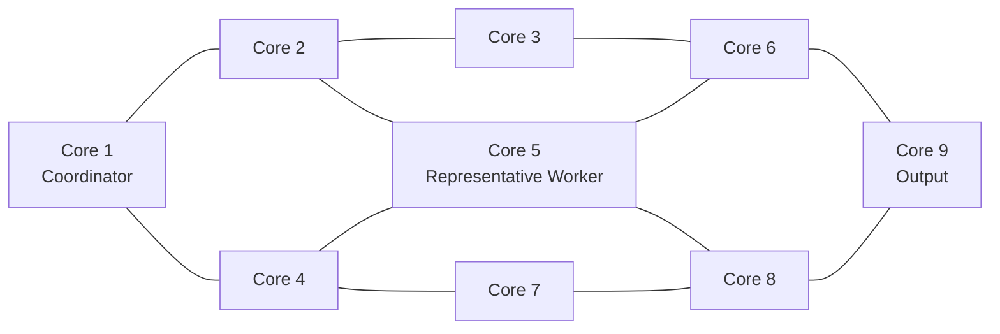

# 3x3 Multi-Core RTL Portfolio

9개의 8-bit 프로세서를 3x3 구조로 연결한 분산 처리 RTL 프로젝트입니다.  
이 저장소는 채용 검토를 위한 **curated code sample**이며, 전체 구현을 공개하지 않습니다.

## Highlights

- 9-core RTL architecture and point-to-point interfaces
- Core 1 기반 global completion/barrier synchronization
- 중앙 Core 5의 4방향 데이터 교환 구조
- SystemVerilog Assertions(SVA)을 이용한 완료 조건 검증
- C++ driver, monitor, scoreboard, functional coverage
- 30 input vectors / 270 output comparisons
- 최종 recovery regression: 270 PASS / 0 FAIL / 0 timeout

## Architecture

`rtl/system_top.sv`는 전체 3x3 topology를 보여줍니다. 공개 코드는 coordinator인 Core 1과 중앙 worker인 Core 5의 내부 구현만 포함합니다.

## My Work

- 9-core top-level RTL integration
- 코어 간 point-to-point interface 연결
- Core 1 global completion/barrier logic 구현
- processor datapath 구성: PC, register file, ALU, control, instruction memory
- C++ driver/monitor/scoreboard 작성
- mismatch aggregation 및 timeout 검출
- functional coverage model 작성
- SVA 정상 동작 및 fault-detection 확인

## Representative RTL

### Core 1: Coordinator and barrier synchronization

Core 1은 각 코어의 완료 신호를 수집해 모든 코어가 완료된 경우에만 `end_signal_total`을 생성합니다. `ENABLE_SVA`가 정의되면 다음 조건을 검사합니다.

- 전체 완료 신호가 너무 일찍 발생하지 않는가
- 모든 코어가 완료됐을 때 전체 완료 신호가 발생하는가
- 개별 완료 신호가 허용된 값만 가지는가
- reset 이후 전체 완료 신호가 제거되는가

### Core 5: Representative worker

중앙 Core 5는 상·하·좌·우 네 방향 interface를 연결하는 대표 worker입니다. 전체 worker 코어를 공개하지 않고도 다중 코어 간 데이터 교환과 processor 구성 방식을 검토할 수 있도록 선택했습니다.

## Verification

`verification/system_top_tb.cpp`에는 다음 요소가 포함됩니다.

- vector-file based driver
- completion-event monitor
- 9-output scoreboard
- transaction별 mismatch 집계
- timeout detection
- C++ functional coverage

`verification/vectors.txt`에는 30개 transaction이 들어 있으며 총 270개 출력을 검사합니다.

| Metric | Result |
|---|---:|
| Input vectors | 30 |
| Output checks | 270 |
| Passed outputs | 270 |
| Failed outputs | 0 |
| Failed transactions | 0 |
| Timeouts | 0 |
| Functional coverage | 100% |

Generated build logs, waveform and tool output은 공개 범위에서 제외했습니다.

## Repository Scope

이 저장소는 의도적으로 전체 빌드 가능한 배포본이 아닙니다. `system_top.sv`에서 전체 topology를 확인할 수 있지만, Core 2-4 및 Core 6-9 내부 구현과 일부 interface는 공개하지 않습니다.

공개 범위에 관한 자세한 내용은 [PUBLIC_RELEASE_SCOPE.md](PUBLIC_RELEASE_SCOPE.md)를 참고하십시오.

## Notice

This repository is provided for portfolio review only. No license is granted for redistribution or commercial use.
