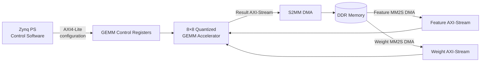

# Zynq PS–PL INT16 GEMM Integration

Zynq PS에서 8×8 INT16 GEMM 가속기를 구동하고, CPU INT16 quantized reference와 PL 결과를 비교한 기록입니다.

기반 GEMM RTL: [Buck008/Transformer-Accelerator-Based-on-FPGA](https://github.com/Buck008/Transformer-Accelerator-Based-on-FPGA) (이 저장소에는 포함하지 않음)
## Architecture

이 다이어그램은 PS가 제어 레지스터를 설정하고, DDR과 PL 사이에서 feature·weight·result 데이터가 DMA/AXI-Stream으로 이동하는 시스템 경계를 보여줍니다. 공개 notebook에는 이 구조를 검증하기 위한 PS-side interface와 결과 해석만 남겨 두었습니다.

## Included

- [축약 notebook](zynq_int16_ps_pl_verification.ipynb)
- PS–PL 역할과 검증 경계
- CPU INT16 quantized reference와 PL 결과의 정합성 수치

## Key Result

| Test | Max abs diff | Same argmax | Top-10 overlap |
|---|---:|:---:|:---:|
| Prefill: CPU quant vs PL | 6.4373e-6 | Yes | 10/10 |
| Decode 1-step: CPU quant vs PL | 1.0490e-5 | Yes | 10/10 |

Top-10 overlap은 상위 10개 후보 집합의 겹침이며, 순위 일치를 뜻하지 않습니다.

PL GEMM RTL 자체의 검증(scoreboard, fault injection, coverage, 성능 분석)은 [npu_gemm_verification](../npu_gemm_verification/README.md)에 정리했습니다.

## Evidence Boundary

- Hardware correctness 기준은 CPU INT16 quantized reference입니다.
- Float model과 quantized model 사이에는 accuracy drift가 확인됐습니다.
- 상세 benchmark cell은 원본에서 실행되지 않았으므로 speedup·throughput 수치를 주장하지 않습니다.
- standalone 실행 패키지가 아닙니다.

## Not Included

- PL RTL and bitstream
- DMA/MMIO implementation details
- tensor packing, weight layout and buffer-pool implementation
- full transformer/KV-cache implementation
- model weights, tokenizer and vocabulary
- raw generated text and token IDs

No license is granted. All rights reserved.
